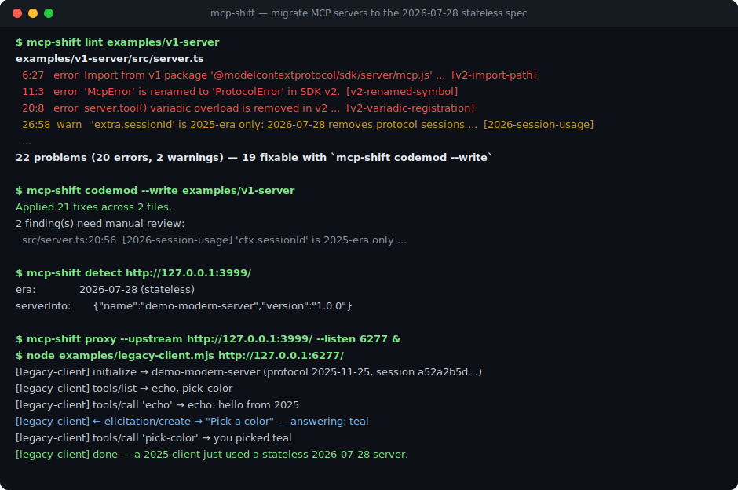
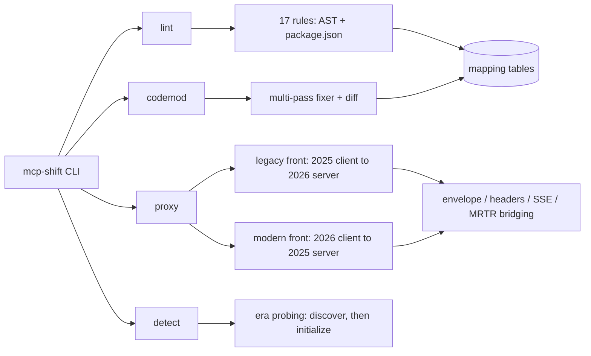

# mcp-shift

[English](README.md) | [中文](README.zh.md) | [日本語](README.ja.md)

[](LICENSE) 

**MCP 2026-07-28 ステートレス新仕様のためのオープンソース移行ツールキット。lint・codemod・新旧双方向の互換 proxy をオフラインで実行できます。**



```bash
# mcp-shift はまだ npm に公開されていません — ソースからインストールします:
git clone https://github.com/JaydenCJ/mcp-shift.git
cd mcp-shift && npm ci && npm run build && npm link
```

## なぜ mcp-shift なのか

2026-07-28、Model Context Protocol は過去最大の破壊的改訂を迎えます。プロトコルセッションの廃止、`initialize` ハンドシェイクの削除、HTTP トランスポートの POST 化、サーバー→クライアントリクエストのマルチラウンドトリップ（MRTR）化により、公式レジストリ上の数万の既存 MCP サーバーは告知された 10 週間の適応期間内に移行を迫られます。しかし仕様チームが提供するのは仕様と SDK だけで、エンタープライズゲートウェイが解決するのはフリート単位のルーティングであり、開発者側の移行ではありません。mcp-shift はその欠けていた開発者側のピースとして、壊れる箇所の特定、機械的な書き換え、移行期間中の新旧相互通信をまとめて引き受けます。

|  | mcp-shift | @modelcontextprotocol/codemod | Enterprise MCP gateways | jscodeshift / ast-grep |
|---|---|---|---|---|
| SDK v1→v2 コード書き換え | yes (17 rules) | yes (SDK surface only) | no | write it yourself |
| 2026-07-28 プロトコル lint | yes | no | no | no |
| 新旧プロトコルの双方向互換 | yes (both directions) | no | partial (fleet-level, commercial) | no |
| 稼働中エンドポイントの世代判定 | yes | no | no | no |
| オフライン動作・アカウント不要 | yes | yes | no | yes |

## 特徴

- **壊れる箇所を正確に把握** — 2 層 17 ルールの conformance lint（TypeScript SDK v1→v2 の表面変更、2026 プロトコル適応）。各指摘には根拠となる SEP を明記し、CI 向けに `--format json` と `--max-warnings` を用意しています。
- **機械的な移行は自動、残りは人手でレビュー** — codemod は既定で dry-run の unified diff を表示し、`--write` で適用します。安全と証明できない書き換えは推測せず手動レビュー報告になり、`package.json` の依存は移行後のソースが実際に import する v2 分割パッケージへ置き換わります。
- **移行期間中もリリースを止めない** — 互換 proxy が、無改造の 2025 クライアントとステートレスな 2026 サーバー、2026 クライアントと 2025 サーバーを双方向に橋渡しします。MRTR ブリッジ（`inputRequests` エントリを本物の `elicitation/create` / `sampling/createMessage` / `roots/list` 往復に変換）も含みます。
- **任意のエンドポイントの世代を判定** — `mcp-shift detect` は仕様の後方互換プロービングアルゴリズムを実装し、稼働中エンドポイントの世代を報告します。
- **オフラインかつ設定不要** — ランタイム依存は `typescript` 1 つ（本物の AST 解析に使用）。設定ファイルなし、アカウント不要、テレメトリなし。proxy は既定で `127.0.0.1` にのみバインドします。

## クイックスタート

インストール:

```bash
# mcp-shift はまだ npm に公開されていません — ソースからインストールします:
git clone https://github.com/JaydenCJ/mcp-shift.git
cd mcp-shift && npm ci && npm run build && npm link
```

最小の例を実行します — 同梱の 2025 世代 fixture サーバーを lint します:

```bash
mcp-shift lint examples/v1-server
```

出力:

```text
examples/v1-server/package.json
  9:5  error  zod ^3.25.0 in dependencies: SDK v2 peer-depends on zod ^4.2.0 ...  [v2-zod-major] (fixable)

examples/v1-server/src/server.ts
  6:27  error  Import from v1 package '@modelcontextprotocol/sdk/server/mcp.js' — moved to '@modelcontextprotocol/server' in SDK v2.  [v2-import-path] (fixable)
  11:3  error  'McpError' is renamed to 'ProtocolError' in SDK v2.  [v2-renamed-symbol] (fixable)
  20:8  error  server.tool() variadic overload is removed in v2 — use registerTool(name, config, cb). ...  [v2-variadic-registration] (fixable)
  26:58  warn   'extra.sessionId' is 2025-era only: 2026-07-28 removes protocol sessions (SEP-2567). ...  [2026-session-usage]
  ...
22 problems (20 errors, 2 warnings) — 19 fixable with `mcp-shift codemod --write`
(scanned 2 files, targeting MCP 2026-07-28)
```

手順 3–5 — 移行・判定・ブリッジ（clone 内で実行します。`bash examples/demo.sh` で同じ流れを一括実行できます）:

```bash
mcp-shift codemod examples/v1-server

node examples/modern-server.mjs 3999 &
mcp-shift detect http://127.0.0.1:3999/

mcp-shift proxy --upstream http://127.0.0.1:3999/ --listen 6277 &
node examples/legacy-client.mjs http://127.0.0.1:6277/
```

## MCP クライアント設定

移行中は、MCP クライアントの接続先をサーバーではなく proxy に向けます（クイックスタート最後の手順で proxy を起動しておきます）。Claude Code の場合は、プロジェクトの `.mcp.json` に次の設定を貼り付けてください。

```json
{
  "mcpServers": {
    "bridged-server": {
      "type": "http",
      "url": "http://127.0.0.1:6277/"
    }
  }
}
```

MCP streamable HTTP に対応した他のクライアントも同様に、サーバー URL として `http://127.0.0.1:6277/` を指定します。proxy はアップストリームの世代を自動判定し、クライアントには反対の世代を提供します（`--front 2025|2026` で固定できます）。

## アーキテクチャ



ルールは薄く、データ駆動です。移行の知識は `src/mappings/` のデータテーブルに集約されているため、仕様のずれはデータ修正で対応できます。lint と codemod は 1 つのエンジンを共有し、codemod は fix 付きの指摘をソースへ適用するだけです。proxy の 2 方向はそれぞれ独立したクラスで、実際の HTTP fixture 上で動くエンドツーエンドテストを備えています。

## 仕様のステータス

最終版の 2026-07-28 仕様はまだ公開されていません（公開日は 2026-07-28 です）。mcp-shift 0.1.x は 2026-05-21 にロックされた release candidate を対象とし、仕様の詳細は公開版を正とします。公開日に最終 changelog と照合して再検証する予定です（`--spec-version` で挙動を固定できます）。完全に変換できない箇所では、proxy は静かにデータを壊すのではなく明示的に縮退します。

- 旧 → 新: SSE の再開性（`Last-Event-ID`）は再構築しません。`tasks/*` と list-changed のファンアウトはロードマップ項目です。
- 新 → 旧: リクエスト単位の identity は最初の一度のアップストリーム `initialize` に固定されます。キャッシュヒントは合成値（`ttlMs: 0`、`cacheScope: "private"`）で、実サーバーのポリシーではありません。
- 新 → 旧: SSE 経由で届くサーバー起点のリクエストは拒否します（2026 には southbound チャネルが存在しないためです）。
- ブリッジした `sampling`/`roots` の要求にクライアントがエラーを返した場合、リクエストは明示的に失敗します（代替結果は捏造しません。elicitation のエラーは正当な decline に対応付けます）。

## ロードマップ

- [x] 0.1 — conformance lint（17 ルール）、codemod、双方向互換 proxy、世代判定。ロックされた RC が対象
- [ ] 0.2 — 2026-07-28 の最終仕様との照合パス。legacy front の `subscriptions/listen` ファンアウト、modern front の SSE ブリッジ
- [ ] 0.3 — SARIF 出力付き CI モード、`.well-known` の capability discovery チェック、tasks 拡張のブリッジ
- [ ] 0.4 — Python SDK（`mcp` v1→v2）ルールパック、conformance レポート向けの proxy トラフィック録画

全体は [open issues](https://github.com/JaydenCJ/mcp-shift/issues) を参照してください。

## コントリビューション

コントリビューションを歓迎します。まずは [good first issue](https://github.com/JaydenCJ/mcp-shift/issues?q=is%3Aissue+is%3Aopen+label%3A%22good+first+issue%22) から、または [Discussions](https://github.com/JaydenCJ/mcp-shift/discussions) でお気軽にどうぞ。詳細は [CONTRIBUTING.md](CONTRIBUTING.md) を参照してください。7/28 までに最も価値がある貢献は、最終 changelog と照合した仕様ずれの報告（リンク付き）です。

## ライセンス

[MIT](LICENSE)
