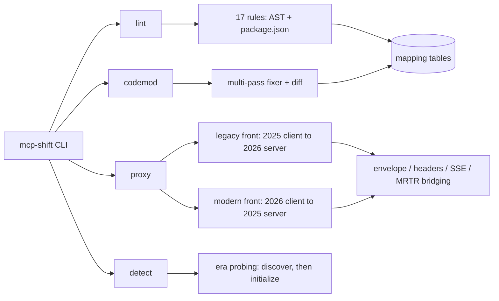

# mcp-shift

[English](README.md) | [中文](README.zh.md) | [日本語](README.ja.md)

[](LICENSE) 

**An open-source, offline migration toolkit for the MCP 2026-07-28 stateless spec: lint, codemod, two-way compat proxy.**


```bash
# mcp-shift is not yet on npm — install from source:
git clone https://github.com/JaydenCJ/mcp-shift.git
cd mcp-shift && npm ci && npm run build && npm link
```

## Why mcp-shift?

On 2026-07-28 the Model Context Protocol ships its biggest breaking revision yet: protocol sessions are removed, the `initialize` handshake is gone, the HTTP transport becomes POST-only, and server→client requests turn into multi-round-trip (MRTR) results. Tens of thousands of MCP servers on the official registry have to migrate inside the announced ten-week adoption window — yet the spec team ships only the spec and SDKs, and enterprise gateways solve fleet routing, not developer-side migration. mcp-shift is the missing developer-side piece: it tells you exactly what breaks, rewrites the mechanical part, and keeps old and new peers talking while you migrate at your own pace.

|  | mcp-shift | @modelcontextprotocol/codemod | Enterprise MCP gateways | jscodeshift / ast-grep |
|---|---|---|---|---|
| SDK v1→v2 code rewrite | yes (17 rules) | yes (SDK surface only) | no | write it yourself |
| 2026-07-28 protocol lint | yes | no | no | no |
| Old ⇄ new wire compatibility | yes (both directions) | no | partial (fleet-level, commercial) | no |
| Era detection for live endpoints | yes | no | no | no |
| Runs offline, no account | yes | yes | no | yes |

## Features

- **Know exactly what breaks** — 17 conformance rules in two tiers (TypeScript SDK v1→v2 surface, 2026 protocol adoption), each finding citing the SEP that caused it; `--format json` and `--max-warnings` for CI.
- **Migrate mechanically, review the rest** — the codemod prints dry-run unified diffs by default and applies with `--write`; rewrites that are not provably safe become a manual-review report instead of guesses, and `package.json` dependencies are swapped to exactly the v2 split packages your migrated sources import.
- **Keep shipping during the transition** — the compatibility proxy bridges unmodified 2025 clients to stateless 2026 servers and 2026 clients to 2025 servers, including full MRTR bridging (`inputRequests` entries become real `elicitation/create` / `sampling/createMessage` / `roots/list` round trips).
- **Know what any endpoint speaks** — `mcp-shift detect` implements the spec's backward-compatibility probing algorithm and reports the era of a live endpoint.
- **Offline and zero-config** — one runtime dependency (`typescript`, used for real AST analysis), no config file, no account, no telemetry; the proxy binds `127.0.0.1` by default.

## Quickstart

Install:

```bash
# mcp-shift is not yet on npm — install from source:
git clone https://github.com/JaydenCJ/mcp-shift.git
cd mcp-shift && npm ci && npm run build && npm link
```

Run the minimal example — lint the bundled 2025-era fixture server:

```bash
mcp-shift lint examples/v1-server
```

Output:

```text
examples/v1-server/package.json
  9:5  error  zod ^3.25.0 in dependencies: SDK v2 peer-depends on zod ^4.2.0 ...  [v2-zod-major] (fixable)

examples/v1-server/src/server.ts
  6:27  error  Import from v1 package '@modelcontextprotocol/sdk/server/mcp.js' — moved to '@modelcontextprotocol/server' in SDK v2.  [v2-import-path] (fixable)
  11:3  error  'McpError' is renamed to 'ProtocolError' in SDK v2.  [v2-renamed-symbol] (fixable)
  20:8  error  server.tool() variadic overload is removed in v2 — use registerTool(name, config, cb). ...  [v2-variadic-registration] (fixable)
  26:58  warn   'extra.sessionId' is 2025-era only: 2026-07-28 removes protocol sessions (SEP-2567). ...  [2026-session-usage]
  ...
22 problems (20 errors, 2 warnings) — 19 fixable with `mcp-shift codemod --write`
(scanned 2 files, targeting MCP 2026-07-28)
```

Steps 3–5 — migrate, probe, bridge (run from the clone; `bash examples/demo.sh` runs the same walkthrough in one shot):

```bash
mcp-shift codemod examples/v1-server

node examples/modern-server.mjs 3999 &
mcp-shift detect http://127.0.0.1:3999/

mcp-shift proxy --upstream http://127.0.0.1:3999/ --listen 6277 &
node examples/legacy-client.mjs http://127.0.0.1:6277/
```

## MCP client setup

While you migrate, point your MCP client at the proxy instead of at the server (start the proxy as in the last Quickstart step). For Claude Code, paste this into your project's `.mcp.json`:

```json
{
  "mcpServers": {
    "bridged-server": {
      "type": "http",
      "url": "http://127.0.0.1:6277/"
    }
  }
}
```

Any other client that speaks MCP over streamable HTTP works the same way: use `http://127.0.0.1:6277/` as the server URL. The proxy auto-detects the upstream era and serves the opposite one (`--front 2025|2026` to pin it).

## Architecture



Rules are thin and data-driven: the migration knowledge lives in `src/mappings/` tables, so spec drift is a data fix. Lint and codemod share one engine — a codemod is just findings whose fix edits get applied. Each proxy direction is an independent class with its own end-to-end test suite running against real HTTP fixtures.

## Spec status

The final 2026-07-28 revision is not published yet — it ships on 2026-07-28. mcp-shift 0.1.x targets the release candidate locked on 2026-05-21; spec details follow the RC and will be re-verified against the final changelog on release day (`--spec-version` pins behavior). Where a translation cannot be perfect, the proxy degrades explicitly instead of corrupting silently:

- old → new: SSE resumability (`Last-Event-ID`) is not reconstructed; `tasks/*` and list-changed fan-out are roadmap items.
- new → old: per-request identity is pinned at the single upstream `initialize`; cache hints are synthesized (`ttlMs: 0`, `cacheScope: "private"`), not real server policy.
- new → old: server-initiated requests arriving over SSE are rejected — no 2026 southbound channel exists.
- Client errors on bridged `sampling`/`roots` legs fail the request explicitly (no invented substitute results; an errored elicitation leg maps to a valid decline).

## Roadmap

- [x] 0.1 — conformance lint (17 rules), codemod, bidirectional compat proxy, era detection, targeting the locked RC
- [ ] 0.2 — final-spec verification pass on 2026-07-28; `subscriptions/listen` fan-out on the legacy front; SSE bridging on the modern front
- [ ] 0.3 — CI mode with SARIF output; `.well-known` capability-discovery checks; tasks-extension bridging
- [ ] 0.4 — Python SDK (`mcp` v1→v2) rule pack; proxy traffic recording for conformance reports

See the [open issues](https://github.com/JaydenCJ/mcp-shift/issues) for the full list.

## Contributing

Contributions are welcome — start with a [good first issue](https://github.com/JaydenCJ/mcp-shift/issues?q=is%3Aissue+is%3Aopen+label%3A%22good+first+issue%22) or open a [discussion](https://github.com/JaydenCJ/mcp-shift/discussions). See [CONTRIBUTING.md](CONTRIBUTING.md); the most valuable contribution before 7/28 is a spec-drift report against the final changelog, with links.

## License

[MIT](LICENSE)
