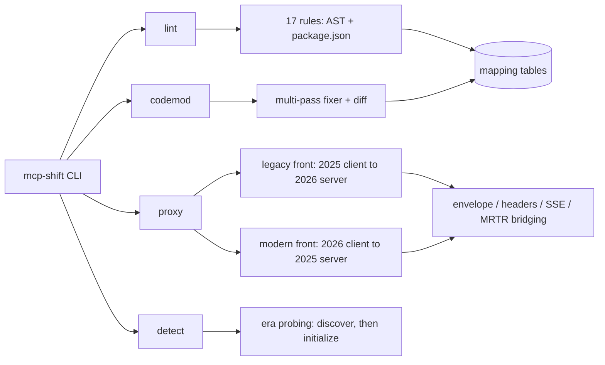

# mcp-shift

[English](README.md) | [中文](README.zh.md) | [日本語](README.ja.md)

[](LICENSE) 

**面向 MCP 2026-07-28 无状态新规范的开源迁移套件：lint、codemod 与新旧双向兼容代理，全程离线运行。**


```bash
# mcp-shift 尚未发布到 npm——从源码安装：
git clone https://github.com/JaydenCJ/mcp-shift.git
cd mcp-shift && npm ci && npm run build && npm link
```

## 为什么是 mcp-shift？

2026-07-28，Model Context Protocol 将发布迄今破坏性最大的一次修订：协议会话被删除、`initialize` 握手不复存在、HTTP 传输改为仅 POST、服务器→客户端请求改为多轮往返（MRTR）结果。官方 Registry 上数万存量 MCP server 必须在官方宣布的十周适配窗口内完成迁移——但规范团队只发规范和 SDK，企业网关解决的是平台级路由而非开发者侧迁移。mcp-shift 补上的正是开发者侧这一环：告诉你到底什么会坏、把机械部分自动改写、并让新旧两代端点在你按自己的节奏迁移期间继续互通。

|  | mcp-shift | @modelcontextprotocol/codemod | Enterprise MCP gateways | jscodeshift / ast-grep |
|---|---|---|---|---|
| SDK v1→v2 代码改写 | yes (17 rules) | yes (SDK surface only) | no | write it yourself |
| 2026-07-28 协议 lint | yes | no | no | no |
| 新旧协议双向互通 | yes (both directions) | no | partial (fleet-level, commercial) | no |
| 在线端点年代探测 | yes | no | no | no |
| 离线运行、无需账号 | yes | yes | no | yes |

## 特性

- **精确知道什么会坏** —— 17 条 conformance 规则分两层（TypeScript SDK v1→v2 表面变更、2026 协议适配），每条发现都标注引发它的 SEP；提供 `--format json` 与 `--max-warnings` 供 CI 使用。
- **机械部分自动迁移，其余留给人审** —— codemod 默认输出 dry-run unified diff，`--write` 才落盘；无法证明安全的改写会生成人工复查报告而不是瞎猜，`package.json` 依赖会被替换为迁移后源码实际 import 的那组 v2 拆分包。
- **过渡期照常发布** —— 兼容代理让未改动的 2025 客户端连上无状态 2026 服务器、也让 2026 客户端连上 2025 服务器，包含完整的 MRTR 桥接（`inputRequests` 条目变成真实的 `elicitation/create` / `sampling/createMessage` / `roots/list` 往返）。
- **知道任意端点说哪一代协议** —— `mcp-shift detect` 实现规范的向后兼容探测算法，报告在线端点的协议年代。
- **离线且零配置** —— 唯一运行时依赖是 `typescript`（用于真正的 AST 分析），没有配置文件、不需要账号、无遥测；代理默认只绑定 `127.0.0.1`。

## 快速开始

安装：

```bash
# mcp-shift 尚未发布到 npm——从源码安装：
git clone https://github.com/JaydenCJ/mcp-shift.git
cd mcp-shift && npm ci && npm run build && npm link
```

运行最小示例——对内置的 2025 时代 fixture 服务器做 lint：

```bash
mcp-shift lint examples/v1-server
```

输出：

```text
examples/v1-server/package.json
  9:5  error  zod ^3.25.0 in dependencies: SDK v2 peer-depends on zod ^4.2.0 ...  [v2-zod-major] (fixable)

examples/v1-server/src/server.ts
  6:27  error  Import from v1 package '@modelcontextprotocol/sdk/server/mcp.js' — moved to '@modelcontextprotocol/server' in SDK v2.  [v2-import-path] (fixable)
  11:3  error  'McpError' is renamed to 'ProtocolError' in SDK v2.  [v2-renamed-symbol] (fixable)
  20:8  error  server.tool() variadic overload is removed in v2 — use registerTool(name, config, cb). ...  [v2-variadic-registration] (fixable)
  26:58  warn   'extra.sessionId' is 2025-era only: 2026-07-28 removes protocol sessions (SEP-2567). ...  [2026-session-usage]
  ...
22 problems (20 errors, 2 warnings) — 19 fixable with `mcp-shift codemod --write`
(scanned 2 files, targeting MCP 2026-07-28)
```

第 3–5 步——迁移、探测、桥接（在 clone 里运行；`bash examples/demo.sh` 可一次跑完同样的流程）：

```bash
mcp-shift codemod examples/v1-server

node examples/modern-server.mjs 3999 &
mcp-shift detect http://127.0.0.1:3999/

mcp-shift proxy --upstream http://127.0.0.1:3999/ --listen 6277 &
node examples/legacy-client.mjs http://127.0.0.1:6277/
```

## MCP 客户端接入

迁移期间，把 MCP 客户端指向代理而不是服务器本身（先按快速开始最后一步启动代理）。Claude Code 用户把下面这段粘进项目的 `.mcp.json` 即可：

```json
{
  "mcpServers": {
    "bridged-server": {
      "type": "http",
      "url": "http://127.0.0.1:6277/"
    }
  }
}
```

其他任何支持 MCP streamable HTTP 的客户端做法相同：把服务器 URL 填成 `http://127.0.0.1:6277/`。代理会自动探测上游年代并向客户端提供相反的一代（用 `--front 2025|2026` 可固定）。

## 架构



规则薄且数据驱动：迁移知识集中在 `src/mappings/` 的数据表里，规范漂移只需改数据。lint 与 codemod 共用一个引擎——codemod 就是把带 fix 的发现应用到源码。代理的两个方向各自是独立的类，各有一套跑在真实 HTTP fixture 上的端到端测试。

## 规范状态

2026-07-28 的最终版规范尚未发布——它在 2026-07-28 当天上线。mcp-shift 0.1.x 以 2026-05-21 锁定的 release candidate 为目标；规范细节以发布版为准，发布日会对照最终 changelog 复核（用 `--spec-version` 可固定行为）。当翻译无法完美时，代理选择显式降级而不是静默损坏：

- 旧 → 新：SSE 可恢复性（`Last-Event-ID`）不做重建；`tasks/*` 与 list-changed 扇出在路线图中。
- 新 → 旧：每请求身份固定为上游那一次 `initialize` 的结果；缓存提示是合成值（`ttlMs: 0`、`cacheScope: "private"`），不是真实服务器策略。
- 新 → 旧：经 SSE 到达的服务器主动请求会被拒绝——2026 没有南向通道可用。
- 桥接的 `sampling`/`roots` 分支上客户端报错时，请求显式失败（不伪造替代结果；elicitation 分支报错则映射为合法的 decline）。

## 路线图

- [x] 0.1 —— conformance lint（17 条规则）、codemod、双向兼容代理、年代探测，以锁定的 RC 为目标
- [ ] 0.2 —— 2026-07-28 当天对照最终规范复核；legacy front 的 `subscriptions/listen` 扇出；modern front 的 SSE 桥接
- [ ] 0.3 —— 带 SARIF 输出的 CI 模式；`.well-known` 能力发现检查；tasks 扩展桥接
- [ ] 0.4 —— Python SDK（`mcp` v1→v2）规则包；代理流量录制用于生成 conformance 报告

完整列表见 [open issues](https://github.com/JaydenCJ/mcp-shift/issues)。

## 参与贡献

欢迎贡献——从 [good first issue](https://github.com/JaydenCJ/mcp-shift/issues?q=is%3Aissue+is%3Aopen+label%3A%22good+first+issue%22) 入手，或到 [Discussions](https://github.com/JaydenCJ/mcp-shift/discussions) 发起讨论。详见 [CONTRIBUTING.md](CONTRIBUTING.md)；7/28 之前最有价值的贡献是对照最终 changelog 的规范漂移报告（附链接）。

## 许可证

[MIT](LICENSE)
